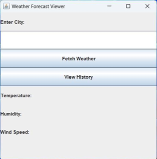
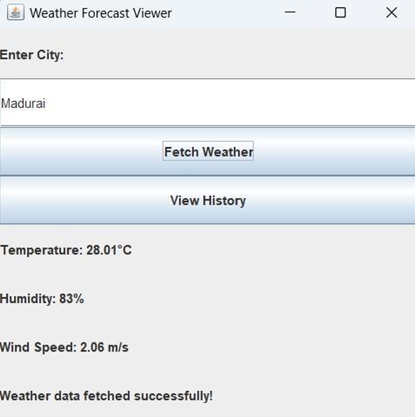

# Weather Prediction System (Java Project)

## Project Overview
This repository contains a Java-based desktop application that predicts weather conditions using real-time data from the OpenWeatherMap API. The system allows users to enter a city name, fetch weather details, and view search history stored in a MySQL database. The application provides a Swing-based GUI for ease of use and demonstrates the integration of APIs with database storage.

## Key Insights
- **Real-Time Weather Data:** Fetches temperature, humidity, and wind speed for any entered city.  
- **User Interface:** Swing-based GUI for input, results display, and interaction.  
- **Database Integration:** MySQL used to store and retrieve search history.  
- **Error Handling:** Handles invalid inputs, API failures, and connection issues.  
- **Search History:** Maintains previous queries with weather details for reference.  

## Dashboard Preview
### 1. Home Page  
  

### 2. Entering a City  
  

### 3. Fetching Weather  
  

### 4. Alert Message for Wrong City Name  
  

### 5. Search History  
  

## Repository Contents
- `WeatherForecastApp.java` – Java source code for the application.  
- `home_page.png` – GUI screenshot (Home Page).  
- `enter_city.png` – GUI screenshot (Enter City).  
- `fetch_weather.png` – GUI screenshot (Fetch Weather).  
- `error_message.png` – GUI screenshot (Error message for invalid city).  
- `search_history.png` – GUI screenshot (Search History).  
- `README.md` – Project documentation.  

## Usage
1. Clone or download this repository.  
2. Set up a MySQL database and create the `search_history` table.  
3. Add your **OpenWeatherMap API key** in the code.  
4. Compile and run the program using **JDK 11** and your preferred IDE.  

## Tools and Technologies
- Java (JDK 11)  
- Swing (GUI)  
- MySQL 5.7  
- JDBC  
- OpenWeatherMap API  

---

**Author:** Manoj Deepan M  
